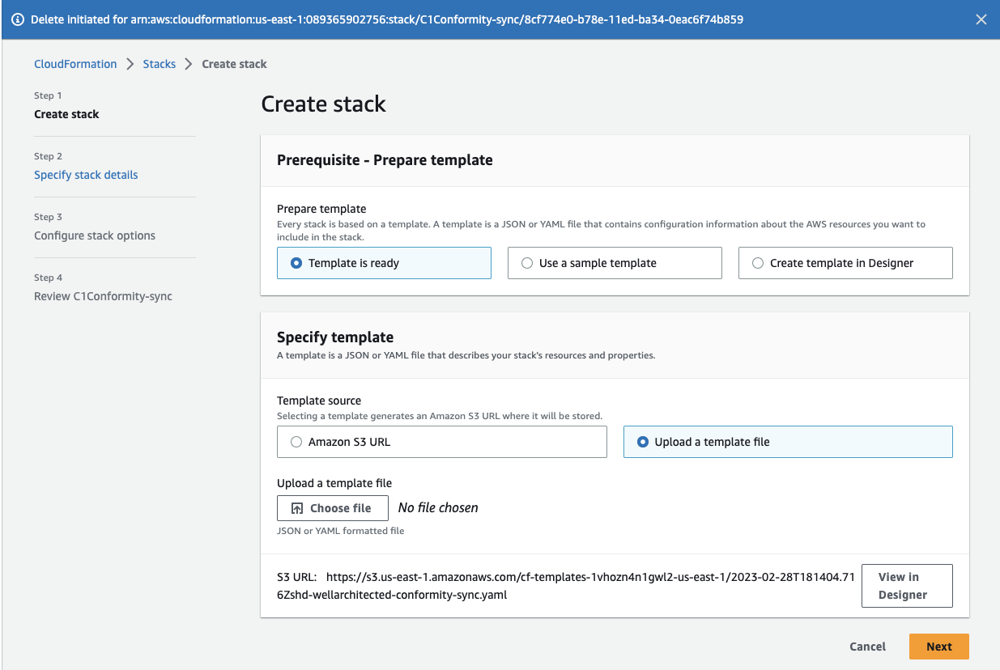
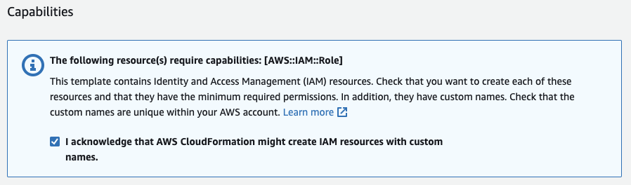

# Well-Architected Conformity Sync

This tools sets up a synchronization link between Cloud One Conformity and the AWS Well Architected tool.

The sync goes in one direction from Conformity to the AWS Well Architected tool. If configurations are remediated you need to run the synchronization again to update the Well Architected tool but keep in mind that the notes will be over-written.

Setting up the Sync tool creates 2 IAM Roles and their policies, AWS SSM Parameters, a secret and a Lambda function.

See https://cloudone.trendmicro.com/docs/conformity/aws-integration/#aws-well-architected-tool for further details about Conformity's integration with the Well Architected tool.

See https://cloudone.trendmicro.com/docs/conformity/api-reference/tag/Well-Architected-Tool for further details about the Conformity WellArchitected sync API.

## Pre-requisites

- Administrator access to the AWS Console. In default, sufficient access rights to run CloudFormation templates and to invoke Lambda functions from the AWS CLI or AWS CloudShell
- A workload configured in the AWS Well Architected tool
- Have the following information available:
  _ **Cloud One Account Id** Hint: it can be obtained from the Conformity API or the Dashboard
  _ **Cloud One Conformity External Id**
  - **Cloud One API Key** with Full Access (Admin)
  - ** Cloud One Conformity AWS Account Id** Hint: it can be obtained from the Conformity API or Dashboard

## Set up using the AWS CloudFormation Console

- Run the AWS CloudFormation template `wellarchitected-conformity-sync.yaml`
  
- Enter the required details
  
- Allow the template to create AWS IAM Roles
  

## Set up using the AWS CLI

Plug your values in the `paramaters.json` file and use the AWS CLI to run the template:

```
aws cloudformation create-stack --stack-name c1c-ssm-sync --capabilities CAPABILITY_NAMED_IAM --template-body file://wellarchitected-conformity-sync-ssm.template.yaml --parameters file://parameters-ssm.json
```

# Questions, Commentaries or Improvements

Raise an issue, question or PR
