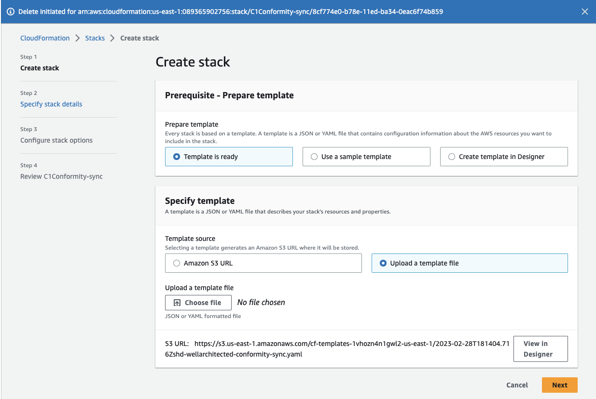
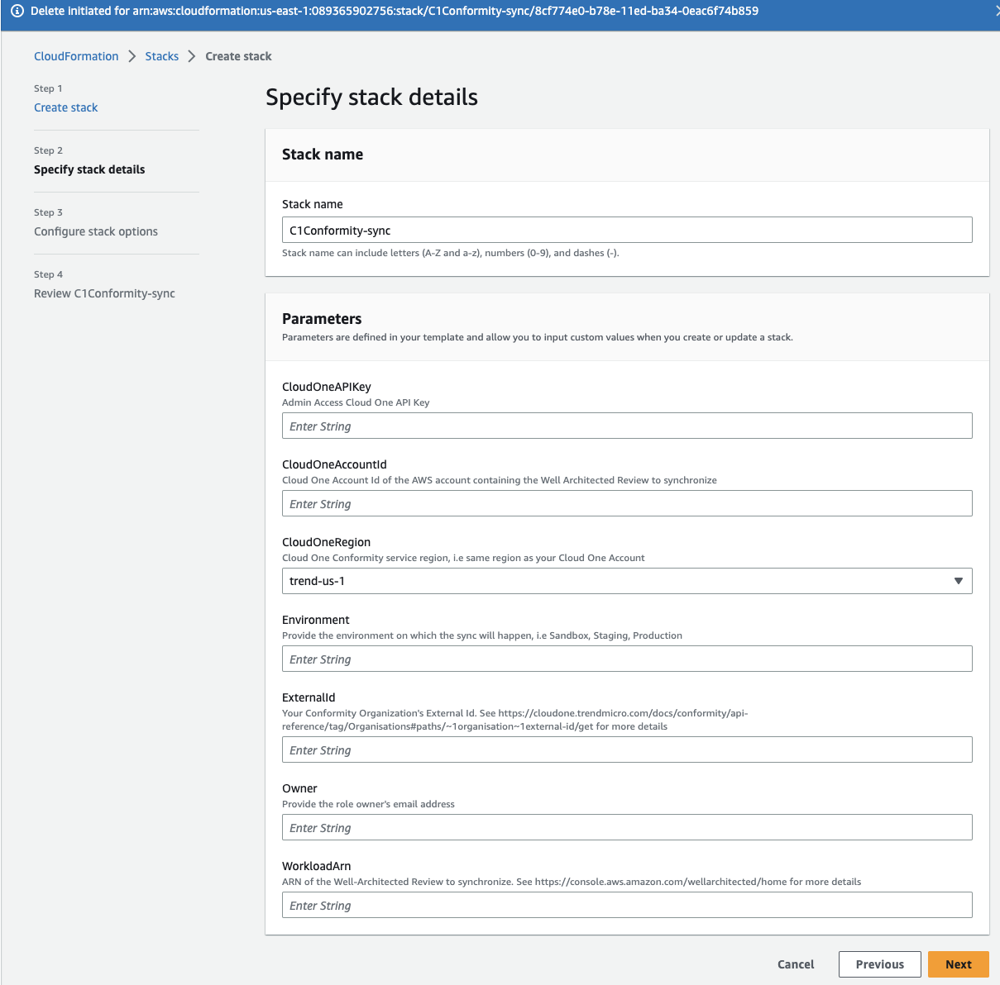
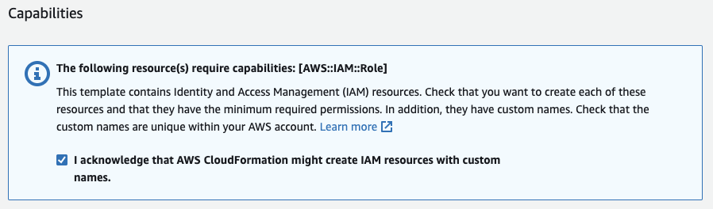

# Well-Architected Conformity Sync

This tools sets up a synchronization link between Cloud One Conformity and the AWS Well Architected tool.

The sync goes in one direction from Conformity to the AWS Well Architected tool. If configurations are remediated you need to run the synchronization again to update the Well Architected tool.

Setting up the Sync tool creates 2 IAM Roles and a Lambda function in your AWS account. These allow Conformity to inform the answers provided to a Well Architected Review.

See https://cloudone.trendmicro.com/docs/conformity/aws-integration/#aws-well-architected-tool for further details about Conformity's integration with the Well Architected tool.

See https://cloudone.trendmicro.com/docs/conformity/api-reference/tag/Well-Architected-Tool for further details about the Conformity WellArchitected sync API.

## Pre-requisites

- Administrator access to the AWS Console. In default, sufficient access rights to run CloudFormation templates and to invoke Lambda functions from the AWS CLI or AWS CloudShell
- A workload configured in the AWS Well Architected tool
- Have the following information available:
  _ **Cloud One Account Id** Hint: it can be obtained from the Conformity API or the Conformity Dashboard
  _ **Cloud One Conformity External Id** \* **Cloud One API Key** with Full Access (Admin)

## Set up

- Run the AWS CloudFormation template `wellarchitected-conformity-sync.yaml`
  
- Enter the required details
  
- Allow the template to create AWS IAM Roles
  

Alternatively, you can use the AWS CLI to run the template:

```
aws cloudformation create-stack --stack-name C1Conformity-sync --template-body file://wellarchitected-conformity-sync.yaml --parameters ParameterKey=ExternalId,ParameterValue=ExternalId ParameterKey=WorkloadArn,ParameterValue=ARN ParameterKey=CloudOneAccountId,ParameterValue=AccountId ParameterKey=CloudOneRegion,ParameterValue=trend-us-1 ParameterKey=CloudOneAPIKey,ParameterValue=APIKey ParameterKey=Environment,ParameterValue=sandbox ParameterKey=Owner,ParameterValue=youremail
```

# Questions, Commentaries or Improvements

Raise and issue or PR
