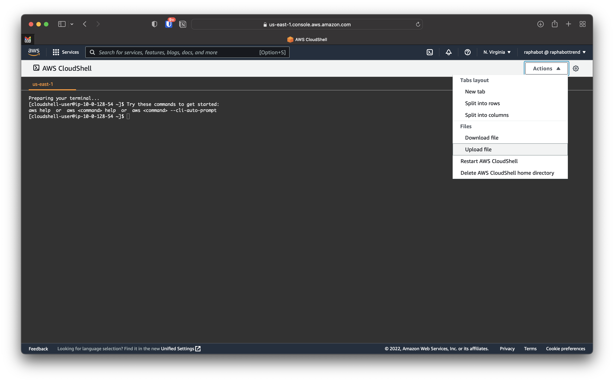

# Container Security Demo Documentation

Welcome to the Container Security Demo Documentation. This package contains all required files to demo Cloud One - Container Security from zero to hero, even if you don't have a Kubernetes cluster.

## Requirements

* Cloud One Account - Any region will do - <https://cloudone.trendmicro.com>
* Cloud One API Key - <https://cloudone.trendmicro.com/docs/identity-and-account-management/c1-api-key/#new-api-key>
* kubectl - <https://kubernetes.io/docs/tasks/tools/>
* helm - <https://helm.sh/docs/intro/install/>
* jq - <https://stedolan.github.io/jq/download/>
* aws cli, configured to use your AWS account of choice. - <https://docs.aws.amazon.com/cli/latest/userguide/getting-started-install.html>
* eksctl, at least version `0.105.0` - <https://docs.aws.amazon.com/eks/latest/userguide/eksctl.html>.
* Internet access 😅 - <https://bfy.tw/Tm18>

## No MacOS or Linux? No problem

<details>
<summary>Click here</summary>

If you are running a Windows machine (you nut!), don't worry. Let's go over how to prepare you entire environment straight from AWS dashboard.

1. Login to your AWS Account
2. Select the AWS CloudShell service, as below:

3. Upload the provided zip to your AWS CloudShell environment, as below:

4. Wait until you see a `File upload successful` popup, as below:

5. To install `eksctl`, run:

     ```bash
     curl --silent --location "https://github.com/weaveworks/eksctl/releases/latest/download/eksctl_$(uname -s)_amd64.tar.gz" | tar xz -C /tmp
     sudo mv /tmp/eksctl /usr/local/bin
     eksctl version
     ```

6. To install `helm`, run:

     ```bash
     sudo yum install -y openssl
     curl https://raw.githubusercontent.com/helm/helm/main/scripts/get-helm-3 | bash
     helm version
     ```

7. Have fun!

</details>

## [Optional] Do you want to integrate with AWS Security Hub?

<details>
<summary>Click here</summary>

Please follow this [documentation](https://github.com/trendmicro/cloudone-community/tree/main/Common/Integration/aws-cdk-securityhub-integration).

</details>

## How to Deploy It

```bash
./deploy.sh REPLACE_WITH_YOUR_CLOUD_ONE_REGION REPLACE_WITH_YOUR_CLOUD_ONE_API_KEY
```

This will:

1. Deploy an EKS cluster
2. Create a Container Security Rule Set, Policy and Cluster
3. Deploy Container Security to your EKS Cluster
4. Deploy purposefully vulnerable applications to the cluster

> ⚠️ The deployment process can take up to 30 minutes.

## Background

Containers and its vast usage in cloud native applications needs no introduction. It's important to remember, however, that these applications are built benefiting from various open source libraries and Operating Systems, where risk may not be clear to a SecOps team for applications in production. Traditional tooling isn't capable of protecting containers in runtime as well.

The `Vulnerability View` is our first step towards providing that visibility quickly and easily to SecOps practitioners. These detections have context, which includes CVE, severity, where the container is running, where the original image came from, and what's the fix available for it, in case one exists. This enables SecOps to quickly identify risky applications with important information such as the type of vulnerability and any available fixes, helping them to start the remediation process, integrating Ops and Dev.

The `Runtime Security` capability...

We know that making this easy and painless is critical, and the demo will show exactly that. We also know that providing visibility into running containers is key, but not the only piece currently missing. That's why this feature is being built as part of a platform built to support us to soon bring this kind of detection closer to the developer, with GitHub, Docker and IDEs integrations to come.

## The Vulnerability View Page

We want to be able to fully understand what kind of information Container Security brings about a vulnerability detection in running containers, and how to make them actionable. This isn't a "how to demo", but rather a deep dive in what a detection looks like and how to act on it. Welcome to the Vulnerability View page.


We have a table that lists all vulnerability detections in running containers for all protected clusters. Each row has the CVE, Severity, Image, Pod, Namespace, Cluster, Package Name, Package Version and Fix available. Cluster name is clickable and takes the user to the cluster page in Container Security.

If you click a detection, the "Detailed View" shows up in the bottom half of the page, with more details about the detection. On top of what's currently available in the row itself, we offer other information such as Description (with a brief -you guessed it- description of the vulnerability), CVE (but this time clickable so a user can read more about the vulnerability), container name, and image tag and digest.

The Fix Available information is particularly interesting when discussing actionability of this data. It provides a quick path to resolve the found vulnerability in the container image.

## Runtime Security

Runtime security provides visibility into container activity that violates a customizable set of rules. Currently, runtime security includes a set of pre-defined rules that provide visibility into MITRE ATT&CK framework tactics for containers, as well as container drift detection. Container Security can automatically mitigate problems detected by the runtime security feature. If a pod violates any rule during runtime, the issue is mitigated by terminating or isolating the pod based on the ruleset assigned to its Container Security policy.

This feature is compatible with Kubernetes and supports Amazon EKS, Microsoft Azure AKS, Google GKE, and OpenShift. It is currently supported with [default and the most recent Linux kernels](https://cloudone.trendmicro.com/docs/container-security/runtime-security/#kernels).

## How to Demo it

### Vulnerable Running Application

First, show that the cluster has the application running running:

```bash
kubectl get pods --namespace demo 
```

Then, show how Container Security is aware of that and how we detected it is vulnerable to the massive Apache Struts 2 vulnerability CVE-2017-5638 going to the Vulnerability View page and filtering the detections to this CVE only.


### Showcasing Time to Value

We want to be able to showcase how easy and simple it is to deploy Container Security and get insightful and actionable information about vulnerabilities in running containers in matter of minutes, if not seconds, being sure that if any vulnerability is exploited during the container lifetime we are capable of react to such an event.

0. Show the empty Vulnerability View page.
1. Deploy containers to your cluster.
2. Deploy Container Security to your cluster.
3. If you haven't yet, take a minute to explain what we are doing behind the scenes.
4. Go to the Vulnerability View page. You should now see the vulnerabilities of running containers.
5. Don't see the vulnerabilities? Wait a few seconds and hit the Refresh button.
6. Profit!

### Showcasing How we Scan Containers on Admission

We want to be able to showcase that we are able to scan containers quickly as they are admitted by the cluster.

0. Make sure you already have Container Security deployed to your cluster.
1. Show the Vulnerability View page and point to the fact it has no vulnerabilities related to the image you are about to deploy.
2. Deploy your container.
3. If you haven't yet, take a minute to explain what we are doing behind the scenes.
4. Go to the Vulnerability View page. You should now see the vulnerabilities of your newly deployed container.
5. Don't see the new vulnerabilities? Wait a few seconds and hit the Refresh button.
6. Profit!

## Container Images Suggestions

Do you need help with some container images and ways to trigger the detections?

Run ubuntu:

```bash
kubectl run my-ubuntu-shell --rm -i --tty --image ubuntu@sha256:bace9fb0d5923a675c894d5c815da75ffe35e24970166a48a4460a48ae6e0d19 -- bash
```

Run Debian:

```bash
kubectl run my-debian-shell --rm -i --tty --image debian@sha256:c11d2593cb741ae8a36d0de9cd240d13518e95f50bccfa8d00a668c006db181e -- bash
```

Run a Log4j vulnerable container:

```bash
kubectl run log4j --rm -i --tty --image guillaumem/java_app
```

Run the java-goof app, vulnerable to Apache Struts2:

```bash
kubectl run apache-struts-2 --rm -i --tty --image raphabot/java-goof@sha256:d4b6eea98318d874d902fb8d0e151b7726837954ffe459bc13f021cb178c7787
```

Run the java-goof app, vulnerable to Apache Struts2:

```bash
kubectl run apache-struts-2 --rm -i --tty --image raphabot/java-goof@sha256:d4b6eea98318d874d902fb8d0e151b7726837954ffe459bc13f021cb178c7787
```

Want to always have a pod running the background?

```bash
kubectl apply -f pods/node-web-app.yaml
```

## Showcasing Runtime Security

```bash
./attack.sh
```

This will take you to a CLI tool to enable you to run attacks from a separated container exploiting a vulnerability in a Apache Struts 2 application.

## How to Clean the environment

You are not made of money. To cleanup the environment, including deleting the EKS cluster:

```bash
./cleanup.sh REPLACE_WITH_YOUR_CLOUD_REGION REPLACE_WITH_YOUR_API_KEY
```

### Interesting Sources

<https://www.linuxfoundation.org/blog/a-summary-of-census-ii-open-source-software-application-libraries-the-world-depends-on/>
<https://www.dynatrace.com/info/cloud-application-security-ciso-research-1/>
