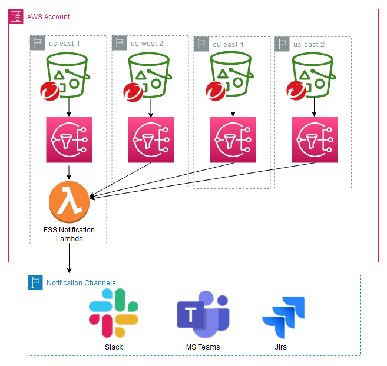

# Subscribe deployed FSS Storage Stack SNS topics to FSS Notification Plugin.
This script will subscribe a deployed Notification plugin like Slack to all deployed FSS storage stacks in a given AWS account. After deployment any malicious event will be sent to the defined notification channel. 



**Before you deploy**

   * Install supporting tools
        - Install and configure the AWS command line interface (CLI). 
        See [Installing the AWS CLI](https://docs.aws.amazon.com/cli/latest/userguide/cli-chap-install.html) for details.
   
   * Configure [AWS Named profile](https://docs.aws.amazon.com/cli/latest/userguide/cli-configure-profiles.html). 

   * If not already present, [deploy the Slack Plugin for File Storage Security](https://github.com/trendmicro/cloudone-filestorage-plugins/tree/master/post-scan-actions/aws-python-slack-notification). This will be needed in order to obtain the Lambda name and ARN.
  
  * Obtain the following parameters.
      - **API Key** - Generate a [Cloud One API Key](https://cloudone.trendmicro.com/docs/account-and-user-management/c1-api-key/)
      - **Cloud One Account** [**Region**](https://cloudone.trendmicro.com/docs/identity-and-account-management/c1-regions/) - example: ```us-1```.
      - **Name** of the norification Lambda Function.
      - **ARN** of the notification Lambda Function.
      - **AWS Region** of the notification Lambda Function.
<hr>

**1. Clone Repo**
 - Clone this repository
 - After cloning repo:
 ```
   cd .\cloudone-community\File-Storage-Security\Deployment\Post-Scan-Action-Automations\aws-notification-automation
```

**2. Run Script**
   - Open terminal/cmd:
   - Can optionally define AWS Profile to use with ```--awsprofile <name of profile to use>``` flag.
   ```
      .\python-aws-automate-subscription.py --apikey <apikey here> --c1region <c1 account region> --functionname <name of slack function --functionarn <slack function arn> --awsregion <aws region to operate in> --pluginregion <aws region where slack plugin resides>
   ```  

