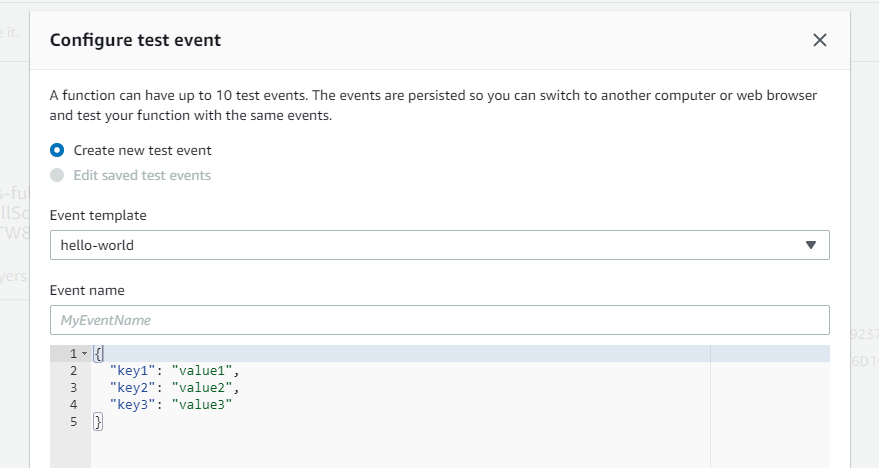

# FSS-Full-Scan

FSS-Full-Scan is a CDK project to deploy all the required resources to trigger a full scan on a S3 bucket leveraging an existing Trend Micro File Storage Security deployment.

## Deployment

Just want to run it? The latest version of the CloudFormation template is always available [here](https://github.com/raphabot/FSS-Full-Scan/releases/latest/download/FssFullScanStack.template.json).

## Note

Make sure to deploy FSS to desired bucket *before* deploying this stack.

## CloudFormation Parameteers

 * `BucketName`         Name of the bucket
 * `ScannerQueueArn`    ARN of the ScannerQueue queue. Something like arn:aws:sqs:us-east-1:123456789012:All-in-one-TM-FileStorageSecurity-ScannerStack-IT1V5O-ScannerQueue-1IOQHTGGGZYFL
 * `ScannerQueueUrl`    URL of the ScannerQueue queue. Something like https://sqs.us-east-1.amazonaws.com/123456789012/All-in-one-TM-FileStorageSecurity-ScannerStack-IT1V5O-ScannerQueue-1IOQHTGGGZYFL
 * `ScanResultTopicArn` ARN of ScanResultTopic topic. Something like arn:aws:sns:us-east-1:123456789012:All-in-one-TM-FileStorageSecurity-StorageStack-1E00QCLBZW7M4-ScanResultTopic-1W7RZ7PBZZUJO

## Running it

After deployment, trigger the new Lambda function `BucketFullScan` with any payload, empty or otherwise, using whatever method you feel most comfortable with. The scan will be queued right after that.

## Running via GUI

Open the Lambda function `BucketFullScan` in Lambda's dashboard. Click in "Test"  an then in "New Test". You should see a window like the one below:

Leave it  as it, add any event name, such as "Full Scan" and press save. Click in "Test" again and wait for execution. All files should be queued for scan now.

## Contributing
Pull requests are welcome. For major changes, please open an issue first to discuss what you would like to change.

## Useful commands

 * `npm run build`          compile typescript to js
 * `npm run watch`          watch for changes and compile
 * `npm run test`           perform the jest unit tests
 * `npm run cloudformation` compiles typescript to js and generates CloudFormation template
 * `cdk deploy`             deploy this stack to your default AWS account/region
 * `cdk diff`               compare deployed stack with current state
 * `cdk synth`              emits the synthesized CloudFormation template

## License
[MIT](https://choosealicense.com/licenses/mit/)