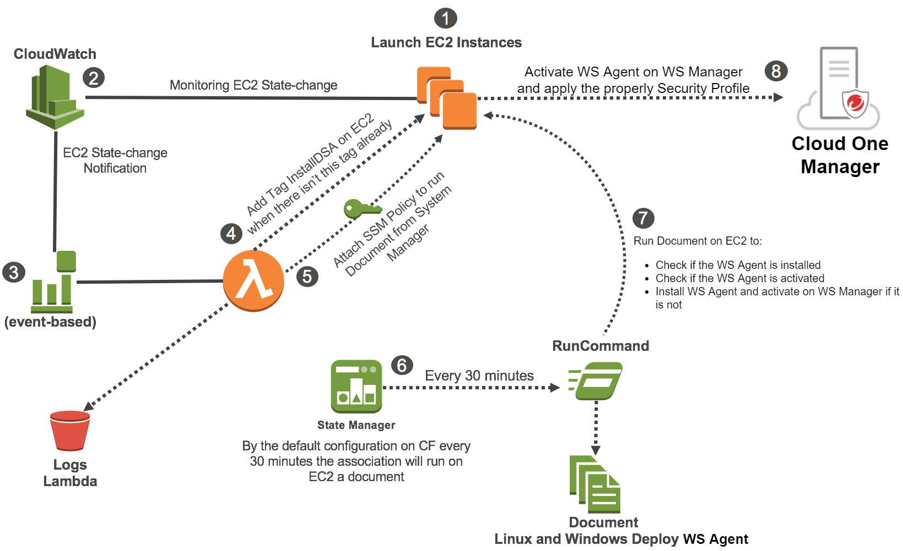

# DS Agents Deploy Automation using Lambda 

Automation process to deploy, activate, and check the Deep Security Agents using Lambda function and State Manger Association from AWS

 
# Next Features (In Progress)
   * Support T0 on Deep Security
      - Support 3 different ways for DSA activation (without TennantID and Token, withou TennatID and with TennantID and Token) in bash and powershell
   * Support Remote Documents with Parameters (minimum TenantID and Token)
 
# Next Features (Planning)
  * Create the possibility to generate diagnostic package from System Manager from remote command with Document
  * Migrate Lambda code to a S3 Bucket global repository. There is a limitation of 4,096 characters today on CloudFormation with ZipFile code inside CloudFormation. The properly Lambda function today has 4,700+ characters
