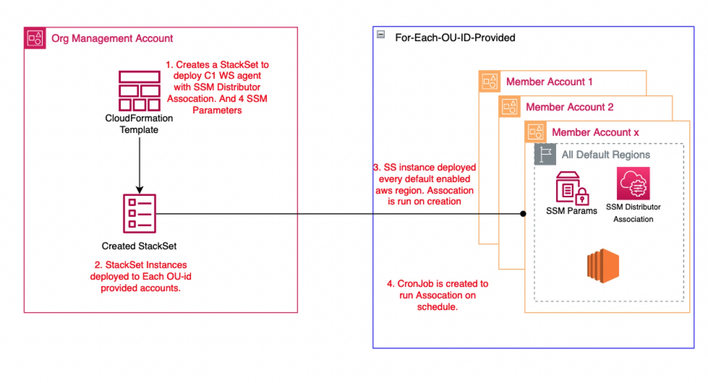

# AWS Organizations Trend Cloud One Workload Security SSM Automation
---

AWS Systems Manager Distributor is a feature integrated with AWS Systems Manager that you can use to securely store and distribute software packages in your accounts. 
By integrating Workload Security with AWS Systems Manager Distributor, you can distribute agents across multiple platforms, control access to managed instances, and automate your deployments.

This solution will distribute Workload Security across OU member accounts across all default enabled regions.



---

## Requirements

1. Download the Yaml Template named ```c1ws-ssm-orgs.template.yaml```.

2. In the Cloud One Workload Security console.
  - Click Support > Select Deployment Scripts.
  - Copy down the manager URL
  - Copy down the activation URL
  - Copy down the tenant ID
  - Copy down the token

---

## How to Deploy

To deploy the solution, launch this CloudFormation template in your organization’s management account.

1. Provide the following inputs for the template parameters:
#### [Automation Details]
  - Stack Name: Enter a name for the Stack.
  - IsDelegatedAdminstrator: Specify if the solution will use a delegated administrator account within the Organization to manage the software packages. CloudFormation StackSet IAM roles should be provisioned.
  - DelegatedAdminAccountId: (Optional) Delegated administrator account ID.
  - ManagementAccountId: (Required) AWS Organization’s Management account ID.
#### [Targets]
  - DeploymentTargets: Specify AWS account IDs and/or the organizational unit IDs within AWS Organization whose accounts have the target instances (e.g., ou-name, 123456789123) for distribution
  - TargetKey: Specify which instances have to be targeted for this solution. Allowed values – ParameterValues, ResourceGroup or begin with tag:, AWS::EC2::Instance, InstanceIds (default), instanceids. Refer to Target for more details.
  - TargetValues: Specify the target key values specified above. Default is *.
  - CronJob: Specify the CRON Job for future scheduling. 
    - [Default is everyday @10:15AM - cron(15 10 * * ? *)] [see here](https://docs.aws.amazon.com/lambda/latest/dg/services-cloudwatchevents-expressions.html)
#### [Cloud One Workload Security]
These were copied down from the worklaod security deployment script.
  - dsActivationUrl
  - dsManagerUrl 	
  - dsTenantId
  - dsToken

2. Create the Stack.

---


