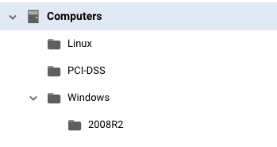

# Moving your Group Structure from Deep Security to Cloud One Workload Security

In order to help you in the migration process from Deep Security to Cloud One Workload Security, this script will help you migrate Computer Groups from Deep Security to Cloud One Workload Security.


## What does this script do?

This script collects your current computers group structure from Deep Security and creating the exact same structure in Cloud One Workload Security via API.

## Usage

### 1. Pre-requisites:

* **Cloud One Workload Security API key**:

    - Have a [Cloud One Workload Security](https://www.trendmicro.com/en_ae/business/products/hybrid-cloud/cloud-one-workload-security.html) account. [Sign up for a free trial now](https://cloudone.trendmicro.com/register) if it's not already the case!

    - An [API key](https://cloudone.trendmicro.com/docs/account-and-user-management/c1-api-key/#create-a-new-api-key) with **"Full Access"** permission;

* **Deep Security Manager**:

    - An **Auditor** or **"READ ONLY"** [API key](https://help.deepsecurity.trendmicro.com/20_0/on-premise/api-key.html), for more details on roles, check this [link](https://help.deepsecurity.trendmicro.com/20_0/on-premise/user-roles.html);
    - Network access from the machine that you will execute the script to the Deep Security Manager;

    - This script was tested on **Deep Security Manager Version 20.0.393**

* **Software Requirements**:

    - This script requires [jq](https://stedolan.github.io/jq/) and [cURL](https://curl.se/) installed on the machine that  executes the script;

> **Note**: This script was tested on **MacOS Monterey 12.1**, **Centos 8.3.2011** and **Ubuntu 20.04.3 LTS**;

### 2. Deployment

- Clone this repository to the machine that you will use or download the [```group_mover.sh```](https://raw.githubusercontent.com/trendmicro/solutions-architect/main/Workload-Security/Migration/bash-group-mover/group_mover.sh?token=GHSAT0AAAAAABUROECUUN5MEEZP32B2S2VQYUFB6PA)
- Edit the file to set environment variables so the script will be able to execute API calls. These are the variables that you should set in the script:

```bash
# For Deep Security:
DSMAPIKEY="My DSM API KEY"
DSM="My DSM URL or IP Address"
DSMPORT="My DSM port, eg. 4119"

# For Cloud One Workload Security:
WSAPIKEY="My Cloud One API KEY"
REGION="My Cloud One Region, eg. us-1"
```

You're ready to execute the script. In this example, we will be moving these groups:



```bash
root@058310e2bd3a ./group_mover.sh

 - Adding all root Groups to Workload Security...

{"type":"folder","name":"Windows","description":"My Windows Group","ID":444}
{"type":"folder","name":"Linux","description":"My Linux Machines","ID":445}
{"type":"folder","name":"PCI-DSS","description":"Sensitive Machines","ID":446}

 - Adding all Sub-Groups to Workload Security...

{"type":"folder","name":"2008R2","description":"Legacy Machines","parentGroupID":444,"ID":447}

No more groups to be added :)
```

In case you try to add a group that already exists, the API will return an appropriate message:

```bash
root@058310e2bd3a:/home ./group_mover.sh

 - Adding all root Groups to Workload Security...

{"message":"Group \"Windows\" already exists."}
{"message":"Group \"Linux\" already exists."}
{"message":"Group \"PCI-DSS\" already exists."}

 - Adding all Sub-Groups to Workload Security...

{"message":"Group \"2008R2\" already exists."}

No more groups to be added :)
```

> **Note**: The script was tested with up to 4 levels of sub-groups, but should work just fine even with more levels.

## Contributing

If you encounter a bug or think of a useful feature or find something confusing in the docs, please [Create a New Issue](https://github.com/trendmicro/solutions-architect/issues/new)!

We :heart: pull requests. If you'd like to fix a bug or contribute to a feature or just correct a typo, please feel free to do so.

If you're thinking of adding a new feature, consider opening an [issue](https://github.com/trendmicro/solutions-architect/issues/new) first to discuss the feature to ensure it aligns with the direction of the project (and potentially
save yourself some time).

## Support

Official support from Trend Micro is not available. Individual contributors may be Trend Micro employees, but are not official support.